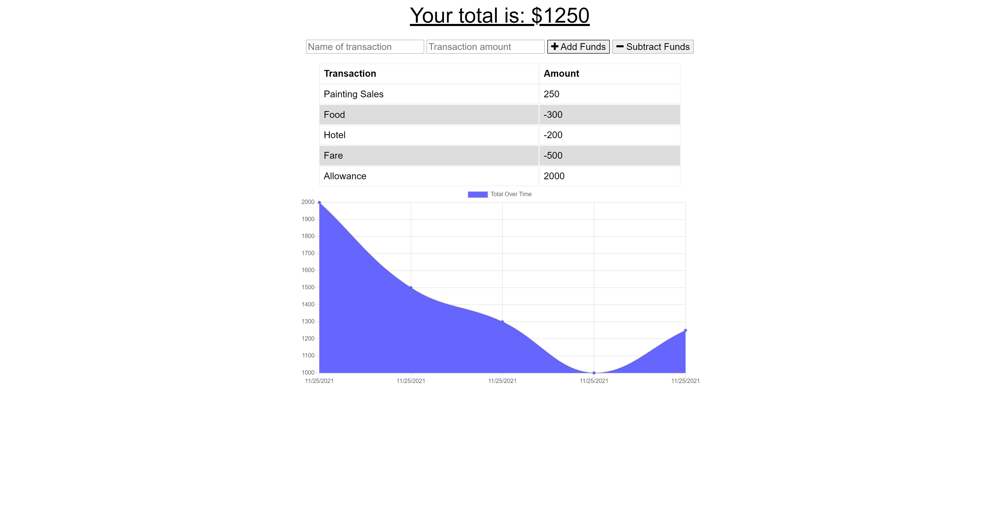

# Budget Tracker (PWA Challenge)

  
    
## Description
  
An application that with track expenses and deposits with or without internet connections.

## Table of Contents
  
* [Installation](#installation)
* [Usage](#usage)
* [License](#license)
* [Contributing](#contributing)
* [Test](#tests)
* [Questions](#questions)
  
## Installation 
  
## Usage 

## Contributing 
 
## Tests 
     
## License

Licensed under [MIT License](./LICENSE).
    
## Questions
   
* GitHub: [mikhaelhamoy](https://github.com/mikhaelhamoy)
* Email: [mhamoy.sm@gmail.com](mailto:mhamoy.sm@gmail.com)

For questions, contact me through email, and for more projects and updates, follow me on GitHub.
    
